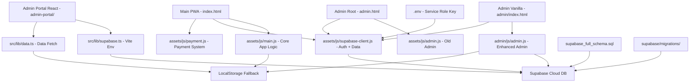

# AdjilBNPL — Error Analysis & Fix Plan

## Project Overview

**Path:** `C:\Users\admin\Documents\trae_projects\AdjilBNPL`

The AdjilBNPL project is an Algerian "Buy Now Pay Later" platform consisting of three main components:

1. **Main PWA App** — A vanilla HTML/JS/CSS front-end (`index.html`, `assets/js/main.js`, etc.)
2. **Admin Panel (Vanilla)** — (`admin/`, `admin.html`) — Basic admin dashboard using Supabase Auth + vanilla JS
3. **Admin Portal (React/Vite)** — (`admin-portal/`) — A React-based admin dashboard with Vite, Tailwind, and recharts

All three use **Supabase** as the backend (PostgreSQL + Auth) with a **localStorage fallback** for offline mode.

---

## Errors Discovered

### 🔴 CRITICAL Errors

#### 1. `admin-portal/.env` is a directory, not a file
- **File:** [`admin-portal/.env`](C:\Users\admin\Documents\trae_projects\AdjilBNPL\admin-portal\.env)
- **Issue:** `.env` exists as an **empty directory** instead of a `.env` file.
- **Impact:** [`admin-portal/src/lib/supabase.ts`](C:\Users\admin\Documents\trae_projects\AdjilBNPL\admin-portal\src\lib\supabase.ts:3) reads `import.meta.env.VITE_SUPABASE_URL` and `VITE_SUPABASE_ANON_KEY` which will always be `undefined`, making `hasSupabase = false` and `supabase = null`. The entire React admin portal cannot connect to Supabase.
- **Fix:** Delete the directory, create a proper `.env` file with the Vite env vars.

#### 2. PWA Manifest — Broken Icon Paths
- **File:** [`manifest.json`](C:\Users\admin\Documents\trae_projects\AdjilBNPL\manifest.json:14)
- **Issue:** Icon `src` references `"assets/Adjil logo/Adjil logo.png"` — there is **no** `assets/Adjil logo/` subdirectory. The actual file is `assets/Adjil logo.png` (with a space, at root of assets).
- **Impact:** PWA installation fails, icons don't load, lighthouse audit fails.
- **Fix:** Change icon paths to `"assets/Adjil logo.png"`. Also fix `sizes` attributes since the same file is declared for both 192x192 and 512x512.

#### 3. Service Worker — Same Broken Icon Path
- **File:** [`sw.js`](C:\Users\admin\Documents\trae_projects\AdjilBNPL\sw.js:9)
- **Issue:** `./assets/Adjil logo/Adjil logo.png` — same non-existent path. Cache pre-fetch will fail, which could cause the entire service worker install to fail.
- **Fix:** Change to `./assets/Adjil logo.png`.

#### 4. Index.html — Broken apple-touch-icon Path
- **File:** [`index.html`](C:\Users\admin\Documents\trae_projects\AdjilBNPL\index.html:14)
- **Issue:** `<link rel="apple-touch-icon" href="assets/Adjil logo/Adjil logo.png">` — broken path.
- **Fix:** Change to `assets/Adjil logo.png`.

---

### 🟡 MEDIUM Errors (Functional Bugs)

#### 5. `payment.js` — `detectCardType()` Null Reference Crash
- **File:** [`assets/js/payment.js`](C:\Users\admin\Documents\trae_projects\AdjilBNPL\assets\js\payment.js:49)
- **Issue:** `document.getElementById('icon-visa')` and `document.getElementById('icon-master')` return `null` if those elements don't exist in the current page. Calling `.classList.remove('visible')` on `null` throws a `TypeError`.
- **Fix:** Add null checks before accessing `.classList`.

#### 6. `payment.js` — `processPayment()` Button State Never Reset on Early Return
- **File:** [`assets/js/payment.js`](C:\Users\admin\Documents\trae_projects\AdjilBNPL\assets\js\payment.js:108)
- **Issue:** Inside the `setTimeout` callback (line 105), if `app.user.status !== 'active'` (line 111) or `amount <= 0` (line 115) or `amount > balance` (line 119), the function does `alert(...)` and `return`. However, the button was already disabled and marked `processing` on lines 99-100. The reset code (lines 150-168) is in a **nested** `setTimeout` that is never reached due to the `return`, leaving the button permanently disabled.
- **Fix:** Move button-reset logic before the early returns, or wrap button state reset in a `finally`-like pattern.

#### 7. SQL Migration — Missing `status` Column in `support_tickets`
- **File:** [`supabase/migrations/20260302_create_tickets.sql`](C:\Users\admin\Documents\trae_projects\AdjilBNPL\supabase\migrations\20260302_create_tickets.sql:2)
- **Issue:** The table is created without a `status` column, but the full schema ([`supabase_full_schema.sql`](C:\Users\admin\Documents\trae_projects\AdjilBNPL\supabase_full_schema.sql:100)) includes `status TEXT DEFAULT 'open'`. The admin JS and admin-portal code both read and display `t.status`.
- **Fix:** Add `status TEXT DEFAULT 'open' CHECK (status IN ('open', 'closed', 'pending'))` to the `CREATE TABLE` in the migration.

#### 8. SQL Migration — `process_transaction` Type Mismatch (UUID vs TEXT)
- **File:** [`supabase/migrations/20260302_update_lifecycle.sql`](C:\Users\admin\Documents\trae_projects\AdjilBNPL\supabase\migrations\20260302_update_lifecycle.sql:36)
- **Issue:** `v_tx_id` is declared as `UUID` (line 36), but the `transactions.id` column is `TEXT` (per the schema). The `RETURNING id INTO v_tx_id` will fail with a type mismatch.
- **Fix:** Change `v_tx_id UUID` to `v_tx_id TEXT`.

#### 9. SQL Inconsistency — `process_transaction` Return Type Mismatch
- **File:** [`supabase_full_schema.sql`](C:\Users\admin\Documents\trae_projects\AdjilBNPL\supabase_full_schema.sql:155) vs [`supabase/migrations/20260302_update_lifecycle.sql`](C:\Users\admin\Documents\trae_projects\AdjilBNPL\supabase\migrations\20260302_update_lifecycle.sql:29)
- **Issue:** Full schema declares `RETURNS JSON`, migration declares `RETURNS JSONB`. Running both creates a conflict.
- **Fix:** Standardize to `RETURNS JSONB` in both files (JSONB is more efficient in PostgreSQL). Also update the full schema to use `jsonb_build_object` consistently.

#### 10. `admin.html` Uses Old Admin JS Without Local/Online Toggle
- **File:** [`admin.html`](C:\Users\admin\Documents\trae_projects\AdjilBNPL\admin.html:156)
- **Issue:** Loads `assets/js/admin.js` — the **old, simplified** version that only supports Supabase Auth. It doesn't have the local/online toggle or the `#toggle-mode` button referenced in the newer [`admin/index.html`](C:\Users\admin\Documents\trae_projects\AdjilBNPL\admin\index.html:168) which loads `admin/js/admin.js`.
- **Fix:** Update `admin.html` to either redirect to `admin/index.html` or use the newer `admin/js/admin.js`.

#### 11. Duplicate `confirm` Key in French Translations
- **File:** [`assets/js/main.js`](C:\Users\admin\Documents\trae_projects\AdjilBNPL\assets\js\main.js:779) and line 809
- **Issue:** The French translations object has `confirm: "Confirmer"` declared twice (lines 779 and 809). The second declaration silently overwrites the first. While the values happen to match, this is a code quality issue and could lead to confusion.
- **Fix:** Remove the duplicate on line 809.

---

### 🔵 LOW / Advisory Issues

#### 12. Security — Plain-Text Passwords
- **Files:** [`supabase_full_schema.sql`](C:\Users\admin\Documents\trae_projects\AdjilBNPL\supabase_full_schema.sql:20), [`assets/js/supabase-client.js`](C:\Users\admin\Documents\trae_projects\AdjilBNPL\assets\js\supabase-client.js:141)
- **Issue:** Passwords are stored as plain text in the `users` table. Login queries do `.eq('password', password)` — comparing plain text. This is a **significant security vulnerability**.
- **Impact:** Any database breach exposes all user passwords. The Supabase RLS policies allow public read access on users, meaning passwords are readable via the anon key.
- **Recommendation:** This requires a full auth migration (to Supabase Auth / bcrypt hashing) which is out of scope for a non-breaking fix. Document as a known risk for future migration.

#### 13. Security — Overly Permissive RLS Policies
- **Files:** [`supabase_full_schema.sql`](C:\Users\admin\Documents\trae_projects\AdjilBNPL\supabase_full_schema.sql:112-136)
- **Issue:** All tables have `FOR SELECT USING (true)`, `FOR INSERT WITH CHECK (true)`, `FOR UPDATE USING (true)` — public access. The `secure_rls_migration.sql` file documents how to fix this but warns it'll break the current custom auth system.
- **Recommendation:** Document as known risk. Future migration to Supabase Auth is required.

#### 14. Duplicate Admin Dashboard (Code Redundancy)
- **Files:** `admin.html` + `assets/js/admin.js` vs `admin/index.html` + `admin/js/admin.js`
- **Issue:** Two copies of the admin panel with different features. The root `admin.html` is a stale version.
- **Recommendation:** Consolidate to use the newer `admin/` version or the React `admin-portal/`.

---

## Architecture Diagram

---

## Execution Plan Summary

| Priority | Fix | Risk Level |
|----------|-----|------------|
| 1 | Delete `admin-portal/.env` dir, create `.env` file | Safe |
| 2 | Fix icon paths in `manifest.json` | Safe |
| 3 | Fix icon path in `sw.js` | Safe |
| 4 | Fix icon path in `index.html` | Safe |
| 5 | Fix null-check in `payment.js detectCardType()` | Safe |
| 6 | Fix button reset in `payment.js processPayment()` | Safe |
| 7 | Add `status` column to tickets migration SQL | Safe |
| 8 | Fix `v_tx_id` type in lifecycle migration SQL | Safe |
| 9 | Standardize `process_transaction` return type | Safe |
| 10 | Update `admin.html` to use newer admin JS | Safe |
| 11 | Remove duplicate `confirm` key in FR translations | Safe |
| 12-14 | Document security issues as known risks | Advisory Only |
